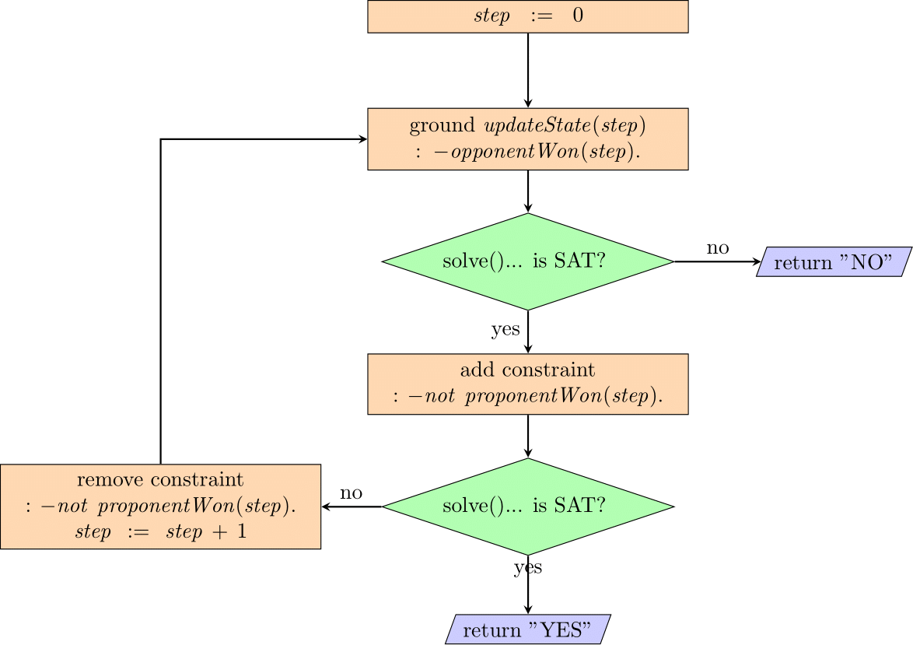
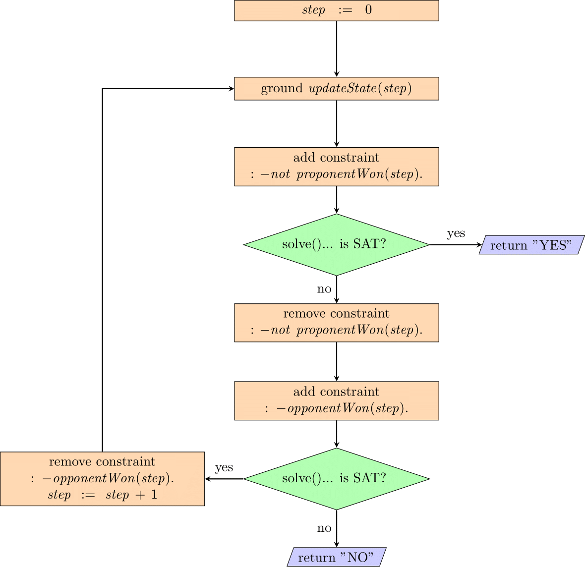
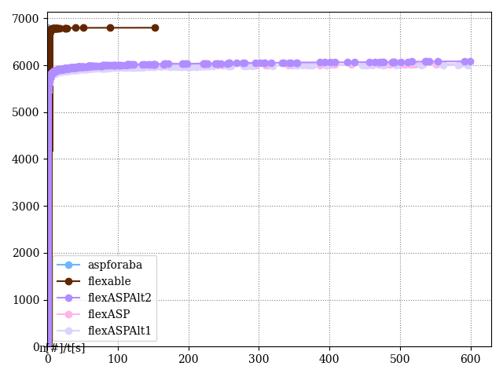

# flexable-asp

## Standard approach

<!-- Refer to: [./multi_shot/flexaspMS.py](./multi_shot/flexaspMS.py) (python code) and [./multi_shot/encodingMultiShot.lp](./multi_shot/encodingMultiShot.lp) (asp encoding). -->



## Alternative approach

<!-- Refer to: [./multi_shot_alt/flexaspMSAlt.py](./multi_shot_alt/flexaspMSAlt.py) (python code) and [./multi_shot_alt/encodingMultiShotAlt.lp](./multi_shot_alt/encodingMultiShotAlt.lp) (asp encoding). -->



## Differences between the two approaches

The standard version first checks whether the game has not been completely lost and only then checks whether the proponent has won. This might seem as inefficient, because assuming the instance can be won by the proponent at step `N`, the program before can obtain this information will "try to find out" whether the game could still be continued at step `N+1`. The idea behind it was that maybe incorporating this constraint earlier would somehow reduce the search space for the later check (if the proponent has won), but most likely this has no effect.

The above has been reversed in the alternative variant. Another difference is that the constraint that `opponentWon(step)` constraint is revoked for the `step+1`, unlike in the standard version, where it remains.

## Incorporating strategies
Some moves (e.g. `PF1`) can be enforced to be performed (if possible) with the help of auxiliary formulas. We considered two versions:

### Version 1)

<!-- Implemented in: [./multi_shot_alt/flexaspMSAlt.py](./multi_shot_alt/flexaspMSAlt.py) (python code) and [./multi_shot_alt/encodingMultiShotAlt.lp](./multi_shot_alt/encodingMultiShotAlt.lp) (asp encoding). -->

Enforce only `PF1` moves (if possible)

```
pf1Possible(t) :- possibleMove(t, "PF1", _).
pf1NotPossible(t) :- not pf1Possible(t).
...
{ move(t, "PF1", X) : possibleMove(t-1, "PF1", X) } = 1 :- pf1Possible(t-1).
{ move(t, Type, X) : possibleMove(t-1, Type, X),  advancementMoveType(Type)  } = 1 :- pf1NotPossible(t-1).
```

### Version 2)

<!-- Implemented in: [./multi_shot_alt_full_strategy/flexaspMSAltStrat.py](./multi_shot_alt_full_strategy/flexaspMSAltStrat.py) (python code) and [./multi_shot_alt_full_strategy/encodingMultiShotAltStrat.lp](./multi_shot_alt_full_strategy/encodingMultiShotAltStrat.lp) (asp encoding). -->

Enforce entire strategy `PF1`, `PB2`, `PF2`, `PB1`, `OB2`, `OF2`, `OB1`.

```
pf1Possible(t) :- possibleMove(t, "PF1", _).
pb2Possible(t) :- possibleMove(t, "PB2", _), not pf1Possible(t).
pf2Possible(t) :- possibleMove(t, "PF2", _), not pf1Possible(t), not pb2Possible(t).
pb1Possible(t) :- possibleMove(t, "PB1", _), not pf1Possible(t), not pb2Possible(t), not pf2Possible(t).
ob2Possible(t) :- possibleMove(t, "OB2", _), not pf1Possible(t), not pb2Possible(t), not pf2Possible(t), not pb1Possible(t).
of2Possible(t) :- possibleMove(t, "OF2", _), not pf1Possible(t), not pb2Possible(t), not pf2Possible(t), not pb1Possible(t), not ob2Possible(t).
ob1Possible(t) :- possibleMove(t, "OB1", _), not pf1Possible(t), not pb2Possible(t), not pf2Possible(t), not pb1Possible(t), not ob2Possible(t), not of2Possible(t).
...
{ move(t, "PF1", X) : possibleMove(t-1, "PF1", X) } = 1 :- pf1Possible(t-1).
{ move(t, "PB2", X) : possibleMove(t-1, "PB2", X) } = 1 :- pb2Possible(t-1).
{ move(t, "PF2", X) : possibleMove(t-1, "PF2", X) } = 1 :- pf2Possible(t-1).
{ move(t, "PB1", X) : possibleMove(t-1, "PB1", X) } = 1 :- pb1Possible(t-1).
{ move(t, "OB2", X) : possibleMove(t-1, "OB2", X) } = 1 :- ob2Possible(t-1).
{ move(t, "OF2", X) : possibleMove(t-1, "OF2", X) } = 1 :- of2Possible(t-1).
{ move(t, "OB1", X) : possibleMove(t-1, "OB1", X) } = 1 :- ob1Possible(t-1).
```

### Possible combinations

| | - | 1 | 2 | 
|-|-|-|-|
|Standard| &#10003; | &#65794; | &#65794; |
|Alternative| &#65794; | &#9675; | &#9675; |


 - &#10003; - implemented, experiments finished
 - &#9675; - implemented, experiments running
 - &#65794; - not implemented


### Source codes
- Standard: [./multi_shot/flexaspMS.py](./multi_shot/flexaspMS.py) (python code) and [./multi_shot/encodingMultiShot.lp](./multi_shot/encodingMultiShot.lp) (asp encoding).
- Alternative 1: [./multi_shot_alt/flexaspMSAlt.py](./multi_shot_alt/flexaspMSAlt.py) (python code) and [./multi_shot_alt/encodingMultiShotAlt.lp](./multi_shot_alt/encodingMultiShotAlt.lp) (asp encoding).
- Alternative 2: [./multi_shot_alt_full_strategy/flexaspMSAltStrat.py](./multi_shot_alt_full_strategy/flexaspMSAltStrat.py) (python code) and [./multi_shot_alt_full_strategy/encodingMultiShotAltStrat.lp](./multi_shot_alt_full_strategy/encodingMultiShotAltStrat.lp) (asp encoding).

## Results so far

|              |   aspforaba |   flexable |   flexASP |   flexASPAlt1 |   flexASPAlt2 |
|:-------------|------------:|-----------:|----------:|--------------:|--------------:|
| timeouts     |        0    |       0    |    773    |        791    |        717    |
| time_tot [h] |        0.03 |       2.87 |    135.7  |        137.87 |        127.61 |
| time_95 [h]  |        0.02 |       2.48 |     79.04 |         81.2  |         70.94 |
| min [s]      |        0    |       0.98 |      0.01 |          0.01 |          0.02 |
| median [s]   |        0.01 |       1.33 |      0.04 |          0.05 |          0.06 |
| mean [s]     |        0.01 |       1.52 |      4.1  |          3.62 |          4.8  |
| max [s]      |        0.07 |     152.78 |    585.44 |        595.95 |        599.47 |

<!--  -->

